# Content Context Vector Checklist

> **Content Context Vector (Wektor Kontekstowy)** to hierarchiczna struktura semantyczna treści (Title → Meta Description → H1 → H2 → H3), która determinuje jak systemy AI rozumieją, parsują i cytują Twoje treści. Prawidłowo zbudowany wektor kontekstowy zwiększa cytowania AI średnio o **34%** i poprawia wyróżniony fragment rate o **21%**.

## Trzy Fundamentalne Zasady

### 1. Semantic Alignment (Zgodność semantyczna)
Wszystkie poziomy hierarchii mówią o **tym samym temacie**. Title określa zakres, Meta go rozszerza, H1 potwierdza, a H2/H3 dzielą na logiczne podsekcje – bez zmiany kontekstu.

### 2. Progressive Refinement (Stopniowe precyzowanie)
Każdy następny poziom **zawęża i uszczegóławia** temat, ale pozostaje w tym samym kontekście semantycznym. Title jest najszerszy, Meta dodaje konkretne parametry, H1 potwierdza fokus.

### 3. Keyword Consistency (Spójność słów kluczowych)
Używaj **naturalnych wariantów** głównego słowa kluczowego przez całą hierarchię – synonimów, form gramatycznych i powiązanych terminów. Unikaj powtarzania identycznej frazy.

---

## Diagram Procesu

```mermaid
flowchart TD

subgraph AUDYT["📋 CZĘŚĆ I: AUDYT"]

direction TB

subgraph T1["🏷️ 1. Title Tag"]

direction TB

T1a["🔴 CV-001<br/>Keyword w pierwszych 60 zn."]

T1b["🟠 CV-002<br/>Długość 50-60 zn."]

T1c["🟠 CV-003<br/>Unikalność"]

T1d["🟠 CV-004<br/>Max 1-2× keyword"]

end

subgraph M1["📝 2. Meta Description"]

direction TB

M1a["🟠 CV-005<br/>Rozszerza Title min 60%"]

M1b["🟡 CV-006<br/>Długość 150-160 zn."]

M1c["🟡 CV-007<br/>LSI keywords 1-2×"]

end

subgraph H1["🔤 3. H1 Tag"]

direction TB

H1a["🔴 CV-008<br/>Tylko JEDEN H1"]

H1b["🔴 CV-009<br/>80-90% similarity z Title"]

H1c["🟠 CV-010<br/>Keyword dowolna forma"]

end

subgraph SA["⭐ 4. Semantic Alignment - RDZEŃ"]

direction TB

SA1["🔴 CV-011<br/>Title→Meta→H1<br/>spójny chain"]

SA2["🔴 CV-012<br/>ZERO zmiany tematu"]

end

subgraph H2["📑 5. Hierarchia H2"]

direction TB

H2a["🟠 CV-013<br/>4-8 nagłówków"]

H2b["🟠 CV-014<br/>Samowyjaśniające"]

H2c["🟡 CV-015<br/>Min 50% pytania"]

H2d["🟡 CV-016<br/>Warianty keywords"]

end

subgraph H3["📄 6. Hierarchia H3"]

direction TB

H3a["🟠 CV-017<br/>Zagnieżdżenie pod H2"]

H3b["🟠 CV-018<br/>Brak przeskakiwania"]

H3c["🟡 CV-019<br/>Sub-concepts H2"]

end

T1 --> M1 --> H1 --> SA --> H2 --> H3

end

  

subgraph OPT["⚙️ CZĘŚĆ II: OPTYMALIZACJA"]

direction TB

subgraph OT["🔧 7-9. Title / Meta / H1"]

direction TB

OT1["🔴 CV-020<br/>Title: Keyword<br/>+ Value Prop"]

OT2["🟠 CV-021<br/>Title UNIKALNY"]

OT3["🟠 CV-022<br/>Meta: Secondary KW<br/>+ Data"]

OT4["🟡 CV-023<br/>Call-to-VALUE"]

OT5["🔴 CV-024<br/>H1: Natural<br/>variation 80-90%"]

OT6["🟡 CV-025<br/>H1 pierwszy<br/>w main"]

end

subgraph OSA["⭐ 10. Semantic Alignment"]

direction TB

OSA1["🔴 CV-026<br/>Three-Element Test:<br/>Title/Meta/H1 = TA SAMA rzecz"]

OSA2["🟠 CV-027<br/>Progressive Refinement:<br/>broad → medium → specific"]

end

subgraph OH["🔧 11. H2/H3"]

direction TB

OH1["🟠 CV-028<br/>Generic → Specific"]

OH2["🟠 CV-029<br/>Min 50% pytania"]

OH3["🟡 CV-030<br/>Unique keyword/H2"]

OH4["🟠 CV-031<br/>H3 co 150-300 słów"]

OH5["🟡 CV-032<br/>H3 = sub-topics"]

end

OT --> OSA --> OH

end

  

subgraph ADV["🚀 CZĘŚĆ III: ZAAWANSOWANE"]

direction TB

ADV1["🟡 CV-033<br/>Keyword 3-5× w wektorze:<br/>Title+Meta+H1+H2"]

ADV2["🟠 CV-034<br/>Entity consistency:<br/>IDENTYCZNA reprezentacja"]

end

  

subgraph MON["📊 CZĘŚĆ IV: MONITORING"]

direction TB

MON1["🔴 CV-035 BASELINE<br/>Test 20-30 queries<br/>ChatGPT/Perplexity/Google AI/Copilot"]

MON2["🟠 CV-036 TRACKING co 30 dni<br/>Re-test queries<br/>Target: +20-40%"]

end

  

AUDYT ==>|"❌ Problemy"| OPT

OPT ==> ADV

ADV ==> MON

MON ==>|"🔄 Po 30-45 dniach"| AUDYT

  

%% KOLORY GŁÓWNYCH SEKCJI

style AUDYT fill:#e3f2fd,stroke:#1565c0,stroke-width:2px,color:#0d47a1

style OPT fill:#f3e5f5,stroke:#7b1fa2,stroke-width:2px,color:#4a148c

style ADV fill:#e8f5e9,stroke:#388e3c,stroke-width:2px,color:#1b5e20

style MON fill:#fff3e0,stroke:#f57c00,stroke-width:2px,color:#e65100

  

%% KOLORY SUBGRAPHÓW AUDYT

style T1 fill:#bbdefb,stroke:#1976d2,color:#0d47a1

style M1 fill:#bbdefb,stroke:#1976d2,color:#0d47a1

style H1 fill:#bbdefb,stroke:#1976d2,color:#0d47a1

style SA fill:#ffcdd2,stroke:#c62828,stroke-width:3px,color:#b71c1c

style H2 fill:#bbdefb,stroke:#1976d2,color:#0d47a1

style H3 fill:#bbdefb,stroke:#1976d2,color:#0d47a1

  

%% KOLORY SUBGRAPHÓW OPTYMALIZACJA

style OT fill:#e1bee7,stroke:#8e24aa,color:#4a148c

style OSA fill:#ffcdd2,stroke:#c62828,stroke-width:3px,color:#b71c1c

style OH fill:#e1bee7,stroke:#8e24aa,color:#4a148c

  

%% KRYTYCZNE ELEMENTY (czerwone tło)

style T1a fill:#ffebee,stroke:#c62828,stroke-width:2px,color:#b71c1c

style H1a fill:#ffebee,stroke:#c62828,stroke-width:2px,color:#b71c1c

style H1b fill:#ffebee,stroke:#c62828,stroke-width:2px,color:#b71c1c

style SA1 fill:#ffebee,stroke:#c62828,stroke-width:2px,color:#b71c1c

style SA2 fill:#ffebee,stroke:#c62828,stroke-width:2px,color:#b71c1c

style OT1 fill:#ffebee,stroke:#c62828,stroke-width:2px,color:#b71c1c

style OT5 fill:#ffebee,stroke:#c62828,stroke-width:2px,color:#b71c1c

style OSA1 fill:#ffebee,stroke:#c62828,stroke-width:2px,color:#b71c1c

style MON1 fill:#ffebee,stroke:#c62828,stroke-width:2px,color:#b71c1c

  

%% WYSOKIE ELEMENTY (pomarańczowe tło)

style T1b fill:#fff8e1,stroke:#ff8f00,stroke-width:1px,color:#e65100

style T1c fill:#fff8e1,stroke:#ff8f00,stroke-width:1px,color:#e65100

style T1d fill:#fff8e1,stroke:#ff8f00,stroke-width:1px,color:#e65100

style M1a fill:#fff8e1,stroke:#ff8f00,stroke-width:1px,color:#e65100

style H1c fill:#fff8e1,stroke:#ff8f00,stroke-width:1px,color:#e65100

style H2a fill:#fff8e1,stroke:#ff8f00,stroke-width:1px,color:#e65100

style H2b fill:#fff8e1,stroke:#ff8f00,stroke-width:1px,color:#e65100

style H3a fill:#fff8e1,stroke:#ff8f00,stroke-width:1px,color:#e65100

style H3b fill:#fff8e1,stroke:#ff8f00,stroke-width:1px,color:#e65100

style OT2 fill:#fff8e1,stroke:#ff8f00,stroke-width:1px,color:#e65100

style OT3 fill:#fff8e1,stroke:#ff8f00,stroke-width:1px,color:#e65100

style OSA2 fill:#fff8e1,stroke:#ff8f00,stroke-width:1px,color:#e65100

style OH1 fill:#fff8e1,stroke:#ff8f00,stroke-width:1px,color:#e65100

style OH2 fill:#fff8e1,stroke:#ff8f00,stroke-width:1px,color:#e65100

style OH4 fill:#fff8e1,stroke:#ff8f00,stroke-width:1px,color:#e65100

style ADV2 fill:#fff8e1,stroke:#ff8f00,stroke-width:1px,color:#e65100

style MON2 fill:#fff8e1,stroke:#ff8f00,stroke-width:1px,color:#e65100

  

%% ŚREDNIE ELEMENTY (żółte tło)

style M1b fill:#fffde7,stroke:#fbc02d,stroke-width:1px,color:#f57f17

style M1c fill:#fffde7,stroke:#fbc02d,stroke-width:1px,color:#f57f17

style H2c fill:#fffde7,stroke:#fbc02d,stroke-width:1px,color:#f57f17

style H2d fill:#fffde7,stroke:#fbc02d,stroke-width:1px,color:#f57f17

style H3c fill:#fffde7,stroke:#fbc02d,stroke-width:1px,color:#f57f17

style OT4 fill:#fffde7,stroke:#fbc02d,stroke-width:1px,color:#f57f17

style OT6 fill:#fffde7,stroke:#fbc02d,stroke-width:1px,color:#f57f17

style OH3 fill:#fffde7,stroke:#fbc02d,stroke-width:1px,color:#f57f17

style OH5 fill:#fffde7,stroke:#fbc02d,stroke-width:1px,color:#f57f17

style ADV1 fill:#fffde7,stroke:#fbc02d,stroke-width:1px,color:#f57f17
```



---


# CZĘŚĆ I: AUDYT

## 1. Title Tag

- [ ] **CV-001 | KRYTYCZNY** Title tag zawiera główne słowo kluczowe w pierwszych 60 znakach
	- Dlaczego: LLM identyfikują główne słowo kluczowe z początku Title jako anchor dla całego wektora kontekstowego
	- Jak sprawdzić: View Page Source → znajdź `<title>` → policz znaki do główne słowo kluczowe
	- Target: Primary keyword w pozycji 0-60 znaków

- [ ] **CV-002 | WYSOKI** Title tag długość 50-60 znaków (optymalna dla wyświetlania w SERP)
	- Dlaczego: Zbyt długi Title zostaje obcięty w SERP, zbyt krótki traci potencjał semantyczny
	- Jak sprawdzić: Screaming Frog → Page Titles → filtruj "Over 60 Characters" i "Under 30 Characters"
	- Target: 50-60 znaków

- [ ] **CV-003 | WYSOKI** Title tag jest unikalny (nie duplikuje się na innych stronach)
	- Dlaczego: Duplicate titles dezorientują LLM co do unikalności contentu
	- Jak sprawdzić: Screaming Frog → Page Titles → filtruj "Duplicate Titles"
	- Target: 0 duplikatów

- [ ] **CV-004 | WYSOKI** Title tag nie zawiera keyword stuffing (max 1-2 wystąpienia główne słowo kluczowe)
	- Dlaczego: Keyword stuffing uznawany przez AI jako spam signal, obniża wskaźnik zaufania
	- Jak sprawdzić: Ręczny przegląd → policz wystąpienia główne słowo kluczowe w Title
	- Target: 1-2 wystąpienia

## 2. Meta Description

- [ ] **CV-005 | WYSOKI** Meta Description rozszerza kontekst z Title (nie powtarza identycznie)
	- Dlaczego: Meta powinna dodawać propozycja wartości i dodatkowe słowa kluczowe, nie duplikować Title
	- Jak sprawdzić: Ręczny przegląd → porównaj Title i Meta Description → sprawdź unikalna wartość adds
	- Target: Min 60% unikalnej treści vs Title

- [ ] **CV-006 | ŚREDNI** Meta Description długość 150-160 znaków
	- Dlaczego: Optymalna długość dla mobile i desktop SERP display
	- Jak sprawdzić: Screaming Frog → Meta Description → filtruj "Over 160" i "Under 120"
	- Target: 150-160 znaków

- [ ] **CV-007 | ŚREDNI** Meta Description zawiera 1-2 dodatkowe słowa kluczowe (LSI keywords)
	- Dlaczego: Secondary keywords wzmacniają semantic context dla LLM
	- Jak sprawdzić: Ręczny przegląd → zidentyfikuj LSI keywords w Meta
	- Target: 1-2 dodatkowe słowa kluczowe

## 3. H1 Tag

- [ ] **CV-008 | KRYTYCZNY** Tylko jeden H1 na stronę
	- Dlaczego: Multiple H1 dezorientują hierarchię i ranking signals
	- Jak sprawdzić: Screaming Frog → H1 → filtruj "Multiple H1" lub Chrome DevTools → Ctrl+F `<h1`
	- Target: 1 H1 na stronę

- [ ] **CV-009 | KRYTYCZNY** H1 potwierdza temat z Title (80-90% semantic similarity)
	- Dlaczego: H1 musi potwierdzać Title dla semantic alignment, ale może użyć synonyms
	- Jak sprawdzić: Ręczny przegląd → porównaj Title i H1 → sprawdź czy mówią o tym samym
	- Target: 80-90% pokrycie semantyczne

- [ ] **CV-010 | WYSOKI** H1 zawiera główne słowo kluczowe (ale może być w innej formie gramatycznej)
	- Dlaczego: Natural language variation poprawia readability bez utraty semantic signal
	- Jak sprawdzić: Ręczny przegląd → sprawdź obecność główne słowo kluczowe lub jego wariantów
	- Target: Primary keyword present (any form)

## 4. Semantic Alignment (NAJWAŻNIEJSZE!)

- [ ] **CV-011 | KRYTYCZNY** Title → Meta → H1 tworzą spójny semantic chain (progressive refinement)
	- Dlaczego: To jest **RDZEŃ** wektora kontekstowego - każdy poziom zawęża i precyzuje bez zmiana tematu
	- Jak sprawdzić: Ręczny przegląd → Title (najszerszy) → Meta (rozwinięcie) → H1 (potwierdzenie) → sprawdź czy każdy level dodaje szczegóły bez zmiany tematu
	- Target: 100% spójność tematu

- [ ] **CV-012 | KRYTYCZNY** Brak zmiana tematu - wszystkie 3 elementy (Title/Meta/H1) mówią o TYM SAMYM
	- Dlaczego: Topic drift (zmiana tematu między poziomami) niszczy wektor kontekstowy i confuses LLM
	- Jak sprawdzić: Ręczny przegląd → wypisz main topic każdego elementu → sprawdź czy są identyczne
	- Target: 0 zmian tematu

## 5. Hierarchia H2

- [ ] **CV-013 | WYSOKI** 4-8 nagłówków H2 na stronę (optymalny zakres)
	- Dlaczego: Za mało H2 = słaba struktura, za dużo H2 = rozmyty fokus
	- Jak sprawdzić: Screaming Frog → H2 → policz liczbę H2 na URL
	- Target: 4-8 H2 na stronę

- [ ] **CV-014 | WYSOKI** Każdy H2 jest samowyjaśniający (zrozumiały samodzielnie)
	- Dlaczego: LLM ekstrahują H2 jako granice fragmentów - muszą być zrozumiałe bez kontekstu
	- Jak sprawdzić: Ręczny przegląd → przeczytaj każdy H2 osobno → czy wiesz o czym jest sekcja?
	- Target: 100% H2 samowyjaśniające

- [ ] **CV-015 | ŚREDNI** H2 odpowiadają na pytania lub jasno nazywają koncepcje
	- Dlaczego: H2 w formie pytań mają wyższy wskaźnik cytowań w systemach AI
	- Jak sprawdzić: Ręczny przegląd → każdy H2 powinien być pytaniem lub jasną nazwą koncepcji
	- Target: Min 50% H2 jako pytania lub jasne koncepcje

- [ ] **CV-016 | ŚREDNI** H2 zawierają naturalne warianty słów kluczowych (nie identyczne frazy)
	- Dlaczego: Różnorodność semantyczna pokazuje głębię tematu, powtarzanie słów kluczowych = spam
	- Jak sprawdzić: Ręczny przegląd → sprawdź czy H2 używają synonimów, powiązanych terminów, nie powtarzają
	- Target: Max 2 H2 z identyczną frazą

## 6. Hierarchia H3

- [ ] **CV-017 | WYSOKI** H3 są zagnieżdżone pod właściwym H2 (logical nesting)
	- Dlaczego: Proper nesting = clear information architecture dla LLM
	- Jak sprawdzić: Chrome DevTools → Elements → sprawdź DOM structure → H3 powinno następować po H2 przed kolejnym H2
	- Target: 100% poprawne zagnieżdżenie

- [ ] **CV-018 | WYSOKI** Brak przeskakiwania poziomów (H1 → H3 bez H2)
	- Dlaczego: Skipped levels = broken hierarchy = confused LLM parsing
	- Jak sprawdzić: Screaming Frog lub manual review DOM → sprawdź czy występuje H3 bez poprzedzającego H2
	- Target: 0 pominiętych poziomów

- [ ] **CV-019 | ŚREDNI** H3 precyzują i zawężają temat z H2 (sub-concepts)
	- Dlaczego: H3 to sub-details H2 - muszą być logicznie powiązane
	- Jak sprawdzić: Ręczny przegląd → przeczytaj H2 + jego H3 → sprawdź czy H3 są szczegółami H2
	- Target: 100% H3 są sub-concepts H2

---

# CZĘŚĆ II: OPTYMALIZACJA

## 7. Optymalizacja Title

- [ ] **CV-020 | KRYTYCZNY** Przepisz Title używając "Primary Keyword + Value Proposition" formula
	- Dlaczego: Formula: [Primary Keyword] - [Value/Benefit/Number] [Year if relevant]
	- Jak zaimplementować: `Ciche Zmywarki - Top 12 Modeli 42dB dla Kuchni Otwartych 2025`
	- Target: Clear value + keyword

- [ ] **CV-021 | WYSOKI** Upewnij się że Title jest UNIKALNY dla każdej strony
	- Dlaczego: Duplicate titles = cannibalization + confused entity recognition
	- Jak zaimplementować: Każdy Title musi mieć unique differentiation factor (lokalizacja, feature, use case)
	- Target: 100% unikalne tytuły

## 8. Optymalizacja Meta Description

- [ ] **CV-022 | WYSOKI** Przepisz Meta aby rozszerzyć Title o Secondary Keywords + Concrete Data
	- Dlaczego: Meta powinna dodać: specs, benefits, social proof (nie duplikować Title)
	- Jak zaimplementować: Template: `[Rozwinięcie tematu]. [Concrete specs/data]. [Benefit/outcome].`
	- Przykład: `Zmywarki 42dB z certyfikatem A+++, kompatybilne ze smart home. Porównanie 12 modeli z testami hałasu i wydajności energetycznej.`
	- Target: Min 2 konkretne dane points

- [ ] **CV-023 | ŚREDNI** Dodaj Call-to-Value (nie Call-to-Action) w Meta
	- Dlaczego: AI preferuje value statements nad marketing CTAs
	- Jak zaimplementować: Zamiast "Kup teraz!" użyj "Porównanie 12 certyfikowanych modeli z testami wydajności"
	- Target: Value-driven ending

## 9. Optymalizacja H1

- [ ] **CV-024 | KRYTYCZNY** Przepisz H1 aby POTWIERDZAŁ Title używając natural language variation
	- Dlaczego: H1 = on-page confirmation of Title promise, ale nie identical copy
	- Jak zaimplementować:
		- Title: `Ciche Zmywarki - Top 12 Modeli 2025`
		- H1: `Najcichsze Zmywarki do Nowoczesnych Domów - Ranking 2025`
	- Target: 80-90% pokrycie semantyczne, 0% word-for-word copy

- [ ] **CV-025 | ŚREDNI** H1 powinien być pierwszym visible elementem w `<main>` lub `<article>`
	- Dlaczego: DOM position signals importance - H1 musi być semantic top of content hierarchy
	- Jak zaimplementować: W HTML: `<main><h1>Title</h1><content>...` lub `<article><header><h1>...`
	- Target: H1 w pierwszych 200 chars visible text

## 10. Optymalizacja Semantic Alignment

- [ ] **CV-026 | KRYTYCZNY** Sprawdź semantic alignment testem "Three-Element Consistency"
	- Dlaczego: Test: Czy Title + Meta + H1 można by użyć jako 3 różne sposoby opisania TEJ SAMEJ rzeczy?
	- Jak zaimplementować:
		1. Main topic Title: _______________
		2. Main topic Meta: _______________
		3. Main topic H1: _______________
		→ muszą być identyczne
	- Target: 100% zgodność głównego tematu

- [ ] **CV-027 | WYSOKI** Przeprowadź "Progressive Refinement Test"
	- Dlaczego: Każdy poziom powinien zawężać temat bez changing scope
	- Jak zaimplementować:
		- Title = `Ciche zmywarki` (broad)
		- Meta = `Zmywarki 42dB dla kuchni otwartych` (narrower)
		- H1 = `Ranking najcichszych zmywarek` (most specific)
		→ wszystkie o zmywarkach!
	- Target: Clear progression: broad → medium → specific

## 11. Optymalizacja H2/H3

- [ ] **CV-028 | WYSOKI** Przekształć generic H2 w specific, samowyjaśniające headings
	- Dlaczego: Generic H2 ('Wprowadzenie', 'Więcej informacji') są bezużyteczne dla LLM chunking
	- Jak zaimplementować:
		- ZŁE: `O produktach`
		- DOBRE: `Porównanie 12 modeli zmywarek pod kątem hałasu`
	- Target: 0 generic H2

- [ ] **CV-029 | WYSOKI** Przekształć min 50% H2 w pytania (question-based headings)
	- Dlaczego: Question-based headings mają wyższy wyróżniony fragment + AI wskaźnik cytowań
	- Jak zaimplementować:
		- PRZED: `Funkcje zmywarki`
		- PO: `Jakie funkcje ma zmywarka Bosch Serie 4?`
	- Target: Min 50% H2 jako pytania

- [ ] **CV-030 | ŚREDNI** Każdy H2 zawiera concrete keyword variant lub related term
	- Dlaczego: Semantic variety = topic authority signal
	- Jak zaimplementować:
		- Primary: `cicha zmywarka`
		- H2 variants: `poziom hałasu`, `ocena dźwięku`, `emisja akustyczna`, `decybele`
	- Target: Unique keyword/phrase per H2

- [ ] **CV-031 | WYSOKI** Dodaj H3 pod każdym H2 który ma >300 słów contentu
	- Dlaczego: Long sections bez H3 = poor chunking boundaries
	- Jak zaimplementować:
		- H2: `Rodzaje materacy`
			- H3: `Materace piankowe`
			- H3: `Materace sprężynowe`
			- H3: `Materace lateksowe`
	- Target: H3 co 150-300 słów w długich sekcjach

- [ ] **CV-032 | ŚREDNI** H3 powinny być sub-topics lub specific aspects of H2
	- Dlaczego: Logical nesting = clear knowledge hierarchy dla LLM
	- Jak zaimplementować:
		- H2: `Jak wybrać materac?`
			- H3: `Dobór według wagi ciała`
			- H3: `Dobór według pozycji snu`
			- H3: `Dobór według preferencji twardości`
	- Target: H3 logicznie wynikają z H2

---

# CZĘŚĆ III: ZAAWANSOWANE

## 12. Keyword Density & Entity Consistency

- [ ] **CV-033 | ŚREDNI** Primary keyword pojawia się 3-5× w całym wektorze (Title, Meta, H1, 1-2 H2)
	- Dlaczego: Optimal gęstość słów kluczowych = strong signal bez stuffing
	- Jak zaimplementować: Count: Title (1×) + Meta (1×) + H1 (1×) + H2 (1-2×) = 4-5× total
	- Target: 3-5 wystąpień

- [ ] **CV-034 | WYSOKI** Wszystkie named entities mają IDENTYCZNE string representation
	- Dlaczego: Exact string match = stable embeddings + better entity recognition
	- Jak zaimplementować:
		- Pick: `Amazon Web Services` → use ZAWSZE
		- NIE mix z: `AWS`, `Amazon Cloud`, `Amazon Web Services (AWS)`
	- Target: 100% spójność encji

---

# CZĘŚĆ IV: MONITORING

## 13. Baseline & Tracking

- [ ] **CV-035 | KRYTYCZNY** Zmierz baseline wskaźnik cytowań przed optymalizacją
	- Dlaczego: Need baseline to measure improvement
	- Jak zaimplementować:
		1. Test 20-30 queries na ChatGPT, Perplexity, Google AI, Microsoft Copilot
		2. Policz ile razy Twoja strona jest cytowana
	- Target: Baseline established

- [ ] **CV-036 | WYSOKI** Track wskaźnik cytowań co 30 dni po zmianach
	- Dlaczego: Vector optimization pokazuje efekty po 30-45 dniach
	- Jak zaimplementować: Re-test te same queries co baseline → porównaj citation count
	- Target: +20-40% wskaźnik cytowań

---

# PRZYKŁADY

## Wektor Prawidłowy

```
Title: Najlepsze Ciche Zmywarki do Kuchni Otwartych 2025
├─ Primary keyword: "ciche zmywarki"
├─ Value prop: "najlepsze", "kuchni otwartych"
├─ Recency: "2025"
└─ Długość: 53 znaki ✓

Meta: Zmywarki 42dB z certyfikatem A+++, kompatybilne ze smart home.
      Porównanie 12 modeli z testami hałasu i wydajności energetycznej.
├─ Rozszerza Title: specs (42dB, A+++), benefit (smart home)
├─ Secondary keywords: "certyfikat", "testy hałasu", "wydajność"
├─ Concrete data: "12 modeli", "42dB"
└─ Długość: 151 znaków ✓

H1: Najcichsze Zmywarki do Nowoczesnych Domów - Ranking 2025
├─ Semantic overlap z Title: 85% ✓
├─ Primary keyword variant: "najcichsze" (synonym "ciche")
├─ Natural variation: "nowoczesnych domów" vs "kuchni otwartych"
└─ Potwierdza temat: zmywarki + hałas ✓

H2 (przykłady):
├─ H2: Co sprawia, że ta zmywarka jest cichsza niż większość modeli?
├─ H2: Jakie funkcje posiada zmywarka Bosch Serie 4?
├─ H2: Porównanie zużycia energii - zmywarki A+++ vs A++
└─ ✓ Question-based, samowyjaśniające, keyword variants

✅ SEMANTIC ALIGNMENT: 100%
✅ PROGRESSIVE REFINEMENT: Broad → Narrow → Specific
✅ KEYWORD CONSISTENCY: Natural variants, no stuffing
```

## Wektor Nieprawidłowy

```
Title: Zmywarki - Sklep Online 2025
├─ ✗ Generic, brak value prop
├─ ✗ "Sklep Online" nie dodaje semantic value
└─ ✗ Za krótkie: 31 znaków

Meta: Najlepsze zmywarki w najlepszych cenach. Sprawdź ofertę!
├─ ✗ Ogólniki ("najlepsze", "sprawdź")
├─ ✗ Brak konkretne dane
├─ ✗ Marketing CTA zamiast value
└─ ✗ Duplikuje Title bez rozszerzenia

H1: Witamy w naszym sklepie z AGD
├─ ✗ Topic drift: "AGD" szersze niż "zmywarki"
├─ ✗ Brak główne słowo kluczowe
└─ ✗ Generic welcome message

H2 (przykłady):
├─ H2: Wprowadzenie
├─ H2: Nasze produkty
├─ H2: Więcej informacji
└─ ✗ Generic, non-descriptive, bezużyteczne dla LLM

✗ SEMANTIC ALIGNMENT: 0% - zmiana tematu na każdym poziomie
✗ PROGRESSIVE REFINEMENT: brak - każdy poziom zmienia temat
✗ KEYWORD CONSISTENCY: brak - keyword pojawia się tylko raz
```

---

# SZYBKI START - 7 DNI

## Dzień 1-2: Audyt (3-4 godziny)
1. Wybierz 10-20 najważniejszych stron
2. Wykonaj CV-001 do CV-012 (Title, Meta, H1, zgodność semantyczna)
3. Zapisz wyniki: `URL | Title OK? | Meta OK? | H1 OK? | Zgodność semantyczna OK?`

## Dzień 3-5: Optymalizacja (5-6 godzin)
Dla każdej strony (~50 min):
1. Popraw Title (CV-020, CV-021) - 10 min
2. Popraw Meta (CV-022, CV-023) - 10 min
3. Popraw H1 (CV-024, CV-025) - 5 min
4. Testuj zgodność semantyczną (CV-026, CV-027) - 5 min
5. Optymalizuj H2/H3 (CV-028 do CV-032) - 20 min

## Dzień 6-7: Baseline (2-3 godziny)
1. Przygotuj 20-30 zapytań testowych
2. Testuj na ChatGPT, Perplexity, Google AI, Copilot
3. Policz cytowania na zapytanie
4. Oblicz bazowy wskaźnik cytowań
5. Za 30 dni: ponowny test i porównanie

---

# NARZĘDZIA

## Audyt
- **Screaming Frog SEO Spider** - audyt Title, Meta, H1, H2, H3, wykrywanie duplikatów
- **Chrome DevTools** (F12 → Elements) - ręczna inspekcja DOM
- **Google Search Console** - monitorowanie wyników SERP

## Optymalizacja
- **Edytor SEO** - liczenie znaków, sprawdzanie gęstości słów kluczowych
- **ChatGPT / Claude** - analiza zgodności semantycznej

```
Prompt:
"Przeanalizuj Content Context Vector (wektor kontekstowy) dla tej strony:

Title: [wklej]
Meta Description: [wklej]
H1: [wklej]

Struktura nagłówków (H2 i H3):
## H2: [wklej H2 #1]
   ### H3: [wklej H3 pod tym H2]
   ### H3: [...]
## H2: [wklej H2 #2]
   ### H3: [...]
## H2: [wklej H2 #3]
...

Oceń według pięciu kryteriów:

1. ZGODNOŚĆ SEMANTYCZNA (Semantic Alignment)
   - Czy Title, Meta, H1, H2 i H3 mówią o TYM SAMYM głównym temacie?
   - Wypisz główny temat każdego poziomu (Title, Meta, H1, ogólnie H2)
   - Oceń % zgodności (100% = identyczny temat, 0% = różne tematy)
   - Czy któryś nagłówek odbiega od głównego tematu (zmiana tematu)?

2. STOPNIOWE PRECYZOWANIE (Progressive Refinement)
   - Title = NAJSZERSZY (określa ogólny temat)
   - Meta = ROZSZERZA Title o szczegóły (specs, korzyści, dane)
   - H1 = POTWIERDZA temat używając naturalnych wariantów słów
   - H2 = DZIELI temat na logiczne podsekcje
   - H3 = USZCZEGÓŁAWIA każdy H2 (sub-concepts)
   - Czy każdy poziom zawęża temat BEZ zmiany kontekstu?

3. SPÓJNOŚĆ SŁÓW KLUCZOWYCH (Keyword Consistency)
   - Czy główne słowo kluczowe pojawia się w Title, Meta, H1 i 1-2 H2?
   - Czy używane są naturalne warianty (synonimy, formy gramatyczne)?
   - Czy NIE ma keyword stuffingu (max 1-2 wystąpienia na element)?
   - Czy H2/H3 używają powiązanych terminów zamiast powtarzania tego samego?

4. JAKOŚĆ H2 (H2 Quality)
   - Czy H2 są samowyjaśniające (zrozumiałe bez kontekstu)?
   - Czy min 50% H2 to pytania lub jasne nazwy koncepcji?
   - Czy jest 4-8 H2 (optymalny zakres)?
   - Czy H2 NIE są generyczne ('Wprowadzenie', 'Więcej informacji')?

5. HIERARCHIA H3 (H3 Structure)
   - Czy H3 są zagnieżdżone pod właściwym H2?
   - Czy H3 precyzują i zawężają temat swojego H2 (są sub-concepts)?
   - Czy NIE ma przeskakiwania poziomów (H1 → H3 bez H2)?
   - Czy H3 są logicznie powiązane z nadrzędnym H2?

Podaj:
- Ocenę każdego kryterium (✅ OK / ⚠️ Do poprawy / ❌ Problem)
- Konkretne rekomendacje naprawy jeśli potrzebne
- Przykład poprawionej wersji jeśli wykryjesz problemy"
```

## Monitoring
- **Testowanie ręczne** - testowanie zapytań na platformach AI, śledzenie w Google Sheets
- **Geoptie** (geoptie.ai) - śledzenie widoczności AI, monitoring cytowań

---

# 10 ZŁOTYCH ZASAD

1. **Title-Meta-H1 = RDZEŃ** wektora - muszą być semantycznie spójne (CV-011)
2. **Stopniowe precyzowanie** - każdy poziom zawęża bez zmiany tematu (CV-027)
3. **Tylko 1 H1** na stronę - absolutny wymóg (CV-008)
4. **4-8 H2** optymalny zakres - struktura bez rozmycia (CV-013)
5. **50% H2 jako pytania** - wyższy wskaźnik cytowań AI (CV-029)
6. **Warianty słów kluczowych** nie powtórzenia - różnorodność semantyczna (CV-016, CV-030)
7. **Spójność encji** - identyczne ciągi znaków zawsze (CV-034)
8. **Samowyjaśniające nagłówki** - H2/H3 zrozumiałe samodzielnie (CV-014)
9. **Baseline przed optymalizacją** - mierz aby wiedzieć czy działa (CV-035)
10. **Re-test co 30 dni** - efekty potrzebują czasu (CV-036)

---

**Oczekiwany ROI:** +20-40% wskaźnik cytowań, +21% wygranych snippetów w ciągu 60-90 dni

**Powiązane:** [[AI SEO CHECKLIST]]
